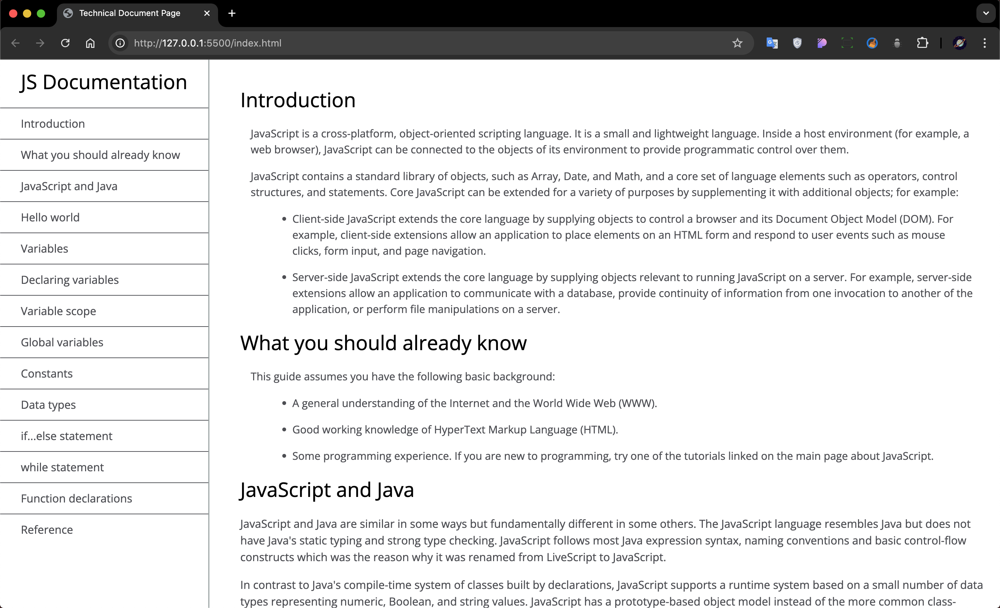

# Document Page

Bu proje, HTML ve CSS kullanılarak oluşturulmuş bir **belge sayfası**dır. Sayfa, modern ve kullanıcı dostu bir tasarıma sahiptir. Ayrıca JavaScript desteğiyle daha dinamik hale getirilmiştir.

## 🚀 Proje Özellikleri

- 🌐 **HTML ve CSS**: Temel yapı ve stilizasyon için kullanıldı.
- ⚡ **JavaScript**: Dinamik içerik ve etkileşimler sağlandı.
- 📱 **Responsive Tasarım**: Farklı cihaz ekranlarına uyumlu.

## 🖼️ Görseller

Aşağıda projeye ait bir ekran görüntüsü bulunmaktadır:



## 🛠️ Nasıl Çalıştırılır?

1. 📂 Bu projeyi klonlayın:
   ```bash
   git clone https://github.com/enescopler/document-page.git
   ```
2. 📁 Proje klasörüne gidin:
   ```bash
   cd document-page
   ```
3. 🌐 `index.html` dosyasını tarayıcınızda açın.

## 📁 Dosya Yapısı

```plaintext
.
├── index.html  # Ana HTML dosyası
├── style.css   # CSS dosyası
├── script.js   # JavaScript dosyası
├── assets/     # Görseller ve medya dosyaları
└── README.md   # Proje açıklaması
```

## 🤝 Katkıda Bulunma

Bu projeyi geliştirmek isterseniz katkılarınızı memnuniyetle karşılarız. Lütfen aşağıdaki adımları takip edin:

1. 🍴 Fork'layın.
2. 🌱 Yeni bir özellik için branch oluşturun:
   ```bash
   git checkout -b yeni-ozellik
   ```
3. ✨ Değişikliklerinizi commit edin:
   ```bash
   git commit -m 'Yeni özellik eklendi'
   ```
4. 🚀 Branch'inizi push edin:
   ```bash
   git push origin yeni-ozellik
   ```
5. 🔄 Bir Pull Request oluşturun.

## 📜 Lisans

Bu proje [MIT Lisansı](LICENSE) ile lisanslanmıştır.
